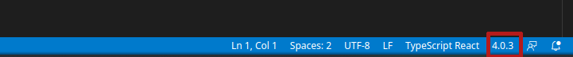
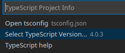

# Sirius Future

## About Project
CRM page with your students.

## __Important!__
Maybe you may get an error like

```zsh
- compilerOptions.jsx must be react-jsx (to support the new JSX transform in React 17)
```
This happening because VSCode using an older version of typescript (4.0.3), while the typescript version shipped with the project is (4.1.2).

For fix this error following:

1. Go to the command palette `CTRL+Shift+P`.
2. Choose "TypeScript: Select a TypeScript Version...".
3. Choose "Use workspace Version".

Or you can use status bar:






## List of technologies
- Type script
- Next
- Emotion
- React
- Recharts

## Build app
If you want to build the app, firstly, you should start the server after that you can do it.
This step need because otherwise build will failing because _next.js_ can't find mock data.

## For starting use this application you should initialize a project

1. First of all, move to directory where you want to see this repo, with command in a terminal:

```zsh
cd $HOME/path/to/your-folder
```

2. Then in the terminal copy this repo with command:
```zsh
git clone https://github.com/Mirhaydarov/sirius-future.git
```

3. And initial project:
```zsh
cd sirius-future
npm i
```

4. For start app use command:
```zsh
npm run dev
```

5. For build app use command:
```zsh
npm run build
```

You can find more commands in root project directory in file package.json to section __"scripts"__.
